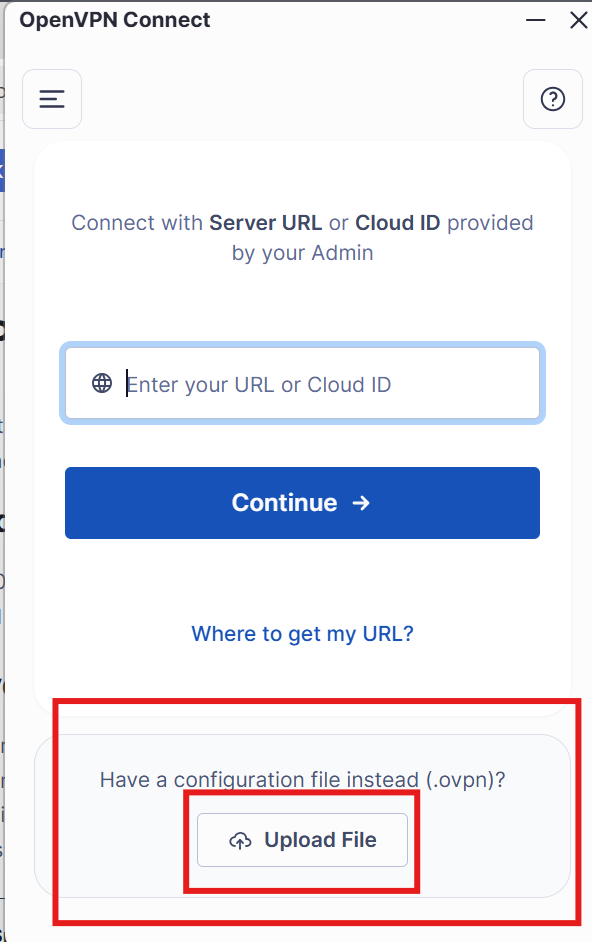
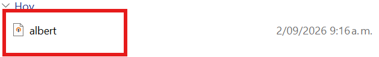
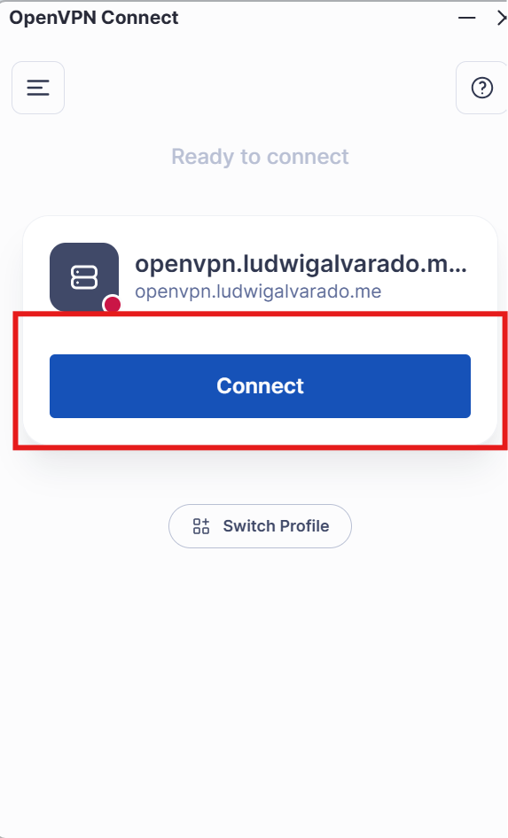
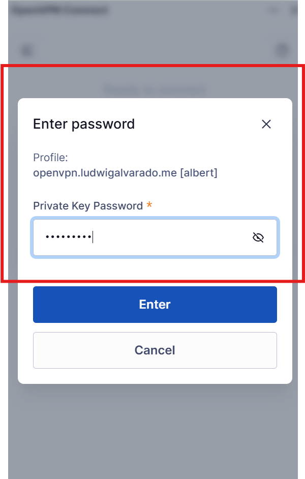

# FlowTM

## Configuración proyecto

### Prerrequisitos

Tener instalado:

- [uv](https://docs.astral.sh/uv/), guía de cómo instalarlo [aquí](https://docs.astral.sh/uv/getting-started/installation/).
- [WSL](https://github.com/microsoft/WSL), guía de cómo instalarlo [aquí](https://learn.microsoft.com/en-us/windows/wsl/install), puede ser cualquier distribución, preferiblemente, [Arch](https://wiki.archlinux.org/title/Install_Arch_Linux_on_WSL#Install_Arch_Linux_in_WSL). 
- [Git](https://git-scm.com/), guía de cómo instalaro en Linux, [aquí](https://git-scm.com/install/linux).
- [7-Zip](https://7-zip.org/), instalador [aquí](https://7-zip.org/download.html). 

### Descomprimir datos

Dentro del directorio `data/raw` están todos los archivos comprimidos con el formato `.7z`, utilizar el programa 7-Zip para descomprimir estos arhivos, desde terminal se puede:

``` sh
7z x archivo.7z
```

En lugar de ir uno por uno ejecutando el comando, se puede ejecutar:

``` sh
for f in **/*.7z; do
7z x $f
done
```

Desde el directorio raíz y automáticamente se descomprimen todos los archivos. 

### Sincronizar paquetes y versiones

Con la ayuda de `uv` se hace:

``` sh
uv sync
```

Esto instala todos los paquetes necesarios para trabajar. 

### Utilizar Marimo

Se va a utilizar [marimo](https://marimo.io/) para trabajar con *notebooks*. Para iniciar un nuevo cuaderno de Marimo, se hace:

``` sh
marimo edit archivo.py
```

### Utilizar Ruff

Para utilizar [ruff](https://docs.astral.sh/ruff/) y verificar el estilo del código entre otras buenas prácticas, recordar que esto se debe correr antes de enviar una PR:

``` sh
uv run ruff check .
```

# VPN
 descargar OpenVPN client link [aqui](https://openvpn.net/connect-docs/connect-for-windows.html#alternative-installation-methods-56623) es el .msi

### Conexion VPN
instalar y al momento de iniciar darle a "Upload File"



Se seleciona archivo .ovpn que envia Ludwig y se importa



Se le da "Connect" 



Se ingresa contraseña que Ludwig envia por interno 



Y con eso ya tendrian la conexion al servidor


