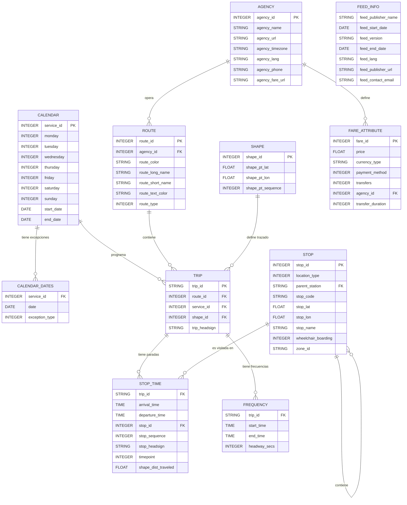

# Diccionario de qué va aquí

Aquí se coloca todo lo que es tema de datos relacionado con Transmilenio.

## GTFS

### `agency.txt`

| Campo             | Tipo    | Descripción                                                              |
|-------------------|---------|--------------------------------------------------------------------------|
| `agency_id`       | INTEGER | Identificador único de la agencia dentro del feed GTFS.                  |
| `agency_name`     | STRING  | Nombre de la agencia o categoría del servicio de transporte.             |
| `agency_url`      | STRING  | URL del sitio web asociado a la agencia o servicio.                      |
| `agency_timezone` | STRING  | Zona horaria utilizada por la agencia. En este caso, `America/Bogota`.   |
| `agency_lang`     | STRING  | Idioma principal de la agencia. En este caso, `es` (español).            |
| `agency_phone`    | STRING  | Número telefónico de contacto de la agencia.                             |
| `agency_fare_url` | STRING  | URL donde se puede consultar información sobre las tarifas del servicio. |

### `calendar.txt`

| Campo        | Tipo    | Descripción                                                                                                                  |
|--------------|---------|------------------------------------------------------------------------------------------------------------------------------|
| `service_id` | INTEGER | Identificador único del calendario de servicio. Es utilizado por `trips.txt` para determinar los días en que opera un viaje. |
| `monday`     | INTEGER | Indica si el servicio opera los lunes. `1`: sí; `0`: no.                                                                     |
| `tuesday`    | INTEGER | Indica si el servicio opera los martes. `1`: sí; `0`: no.                                                                    |
| `wednesday`  | INTEGER | Indica si el servicio opera los miércoles. `1`: sí; `0`: no.                                                                 |
| `thursday`   | INTEGER | Indica si el servicio opera los jueves. `1`: sí; `0`: no.                                                                    |
| `friday`     | INTEGER | Indica si el servicio opera los viernes. `1`: sí; `0`: no.                                                                   |
| `saturday`   | INTEGER | Indica si el servicio opera los sábados. `1`: sí; `0`: no.                                                                   |
| `sunday`     | INTEGER | Indica si el servicio opera los domingos. `1`: sí; `0`: no.                                                                  |
| `start_date` | DATE    | Fecha de inicio de vigencia del calendario, en formato `YYYYMMDD`.                                                           |
| `end_date`   | DATE    | Fecha de finalización de vigencia del calendario, en formato `YYYYMMDD`.                                                     |

### `calendar_dates.txt`

| Campo            | Tipo    | Descripción                                                                                                         |
|------------------|---------|---------------------------------------------------------------------------------------------------------------------|
| `service_id`     | INTEGER | Identificador del servicio al que se aplica la excepción. Corresponde a un `service_id` definido en `calendar.txt`. |
| `date`           | DATE    | Fecha en la que se aplica la excepción, en formato `YYYYMMDD`.                                                      |
| `exception_type` | INTEGER | Tipo de excepción. `1`: agrega el servicio para esa fecha; `2`: elimina el servicio para esa fecha.                 |

### `routes.txt`

| Campo              | Tipo    | Descripción                                                                                                       |
|--------------------|---------|-------------------------------------------------------------------------------------------------------------------|
| `agency_id`        | INTEGER | Identificador de la agencia que opera la ruta. Corresponde a `agency_id` en `agency.txt`.                         |
| `route_color`      | STRING  | Color utilizado para representar visualmente la ruta. Generalmente se expresa como un código hexadecimal sin `#`. |
| `route_id`         | INTEGER | Identificador único de la ruta dentro del feed. Es utilizado por `trips.txt`.                                     |
| `route_long_name`  | STRING  | Nombre largo o descripción de la ruta, normalmente asociado al destino o recorrido.                               |
| `route_short_name` | STRING  | Nombre corto, código o identificador comercial de la ruta.                                                        |
| `route_text_color` | STRING  | Color del texto utilizado al representar la ruta. Se expresa como código hexadecimal.                             |
| `route_type`       | INTEGER | Tipo de transporte de la ruta según la clasificación GTFS. En este caso, `3` corresponde a servicio de bus.       |

### `trips.txt`

| Campo           | Tipo    | Descripción                                                                                                                          |
|-----------------|---------|--------------------------------------------------------------------------------------------------------------------------------------|
| `route_id`      | INTEGER | Identificador de la ruta a la que pertenece el viaje. Corresponde a `route_id` en `routes.txt`.                                      |
| `service_id`    | INTEGER | Identificador del calendario de servicio que determina los días en que opera el viaje. Corresponde a `service_id` en `calendar.txt`. |
| `shape_id`      | INTEGER | Identificador del trazado geográfico utilizado por el viaje. Corresponde a `shape_id` en `shapes.txt`.                               |
| `trip_headsign` | STRING  | Texto que identifica el destino del viaje y que puede mostrarse al usuario.                                                          |
| `trip_id`       | STRING  | Identificador único del viaje dentro del feed GTFS. Es utilizado por `stop_times.txt`.                                               |

### `stop_times.txt`

| Campo                 | Tipo    | Descripción                                                                                        |
|-----------------------|---------|----------------------------------------------------------------------------------------------------|
| `trip_id`             | STRING  | Identificador del viaje. Corresponde a `trip_id` en `trips.txt`.                                   |
| `arrival_time`        | TIME    | Hora programada de llegada del viaje a la parada.                                                  |
| `departure_time`      | TIME    | Hora programada de salida del viaje de la parada.                                                  |
| `stop_id`             | INTEGER | Identificador de la parada. Corresponde a `stop_id` en `stops.txt`.                                |
| `stop_sequence`       | INTEGER | Orden en el que la parada es visitada durante el viaje.                                            |
| `stop_headsign`       | STRING  | Texto que indica el destino mostrado para el viaje a partir de esta parada.                        |
| `timepoint`           | INTEGER | Indica si el horario corresponde a un punto de control temporal. `1`: sí; `0`: no.                 |
| `shape_dist_traveled` | FLOAT   | Distancia recorrida desde el inicio del trazado hasta la parada, generalmente expresada en metros. |

### `stops.txt`

| Campo                 | Tipo    | Descripción                                                                                                            |
|-----------------------|---------|------------------------------------------------------------------------------------------------------------------------|
| `location_type`       | INTEGER | Tipo de ubicación según GTFS. `0`: parada; `1`: estación o agrupador de paradas.                                       |
| `parent_station`      | STRING  | Identificador de la estación padre a la que pertenece la parada, cuando aplica.                                        |
| `stop_code`           | STRING  | Código público asociado a la parada o estación.                                                                        |
| `stop_id`             | INTEGER | Identificador único de la parada o estación. Es utilizado por `stop_times.txt`.                                        |
| `stop_lat`            | FLOAT   | Latitud geográfica de la parada o estación.                                                                            |
| `stop_lon`            | FLOAT   | Longitud geográfica de la parada o estación.                                                                           |
| `stop_name`           | STRING  | Nombre de la parada o estación.                                                                                        |
| `wheelchair_boarding` | INTEGER | Indica la disponibilidad de acceso para usuarios en silla de ruedas. `0`: información no disponible; `1`: sí; `2`: no. |
| `zone_id`             | STRING  | Identificador de la zona tarifaria a la que pertenece la parada, cuando aplica.                                        |

### `shapes.txt`

| Campo               | Tipo    | Descripción                                                    |
|---------------------|---------|----------------------------------------------------------------|
| `shape_id`          | INTEGER | Identificador único del trazado. Es utilizado por `trips.txt`. |
| `shape_pt_lat`      | FLOAT   | Latitud geográfica del punto del trazado.                      |
| `shape_pt_lon`      | FLOAT   | Longitud geográfica del punto del trazado.                     |
| `shape_pt_sequence` | INTEGER | Orden en el que debe conectarse el punto dentro del trazado.   |

### `frequencies.txt`

| Campo          | Tipo    | Descripción                                                                                     |
|----------------|---------|-------------------------------------------------------------------------------------------------|
| `trip_id`      | STRING  | Identificador del viaje al que se aplica la frecuencia. Corresponde a `trip_id` en `trips.txt`. |
| `start_time`   | TIME    | Hora a partir de la cual comienza a aplicarse la frecuencia.                                    |
| `end_time`     | TIME    | Hora hasta la cual se aplica la frecuencia.                                                     |
| `headway_secs` | INTEGER | Intervalo de tiempo, en segundos, entre la salida de vehículos consecutivos.                    |

### `fare_attributes.txt`

| Campo               | Tipo    | Descripción                                                                                          |
|---------------------|---------|------------------------------------------------------------------------------------------------------|
| `fare_id`           | INTEGER | Identificador único de la tarifa.                                                                    |
| `price`             | FLOAT   | Precio de la tarifa.                                                                                 |
| `currency_type`     | STRING  | Código de la moneda utilizada. En este caso, `COP` (peso colombiano).                                |
| `payment_method`    | INTEGER | Método de pago requerido. `0`: pago al abordar; `1`: pago antes de abordar.                          |
| `transfers`         | INTEGER | Número de transbordos permitidos con esta tarifa. Un valor vacío indica que no se especifica.        |
| `agency_id`         | INTEGER | Identificador de la agencia a la que pertenece la tarifa. Corresponde a `agency_id` en `agency.txt`. |
| `transfer_duration` | INTEGER | Duración, en segundos, durante la cual son válidos los transbordos asociados a la tarifa.            |

### `feed_info.txt`

| Campo                 | Tipo   | Descripción                                                                  |
|-----------------------|--------|------------------------------------------------------------------------------|
| `feed_publisher_name` | STRING | Nombre del organismo o entidad que publica el feed GTFS.                     |
| `feed_start_date`     | DATE   | Fecha inicial de vigencia de la información del feed, en formato `YYYYMMDD`. |
| `feed_version`        | STRING | Versión del feed GTFS.                                                       |
| `feed_end_date`       | DATE   | Fecha final de vigencia de la información del feed, en formato `YYYYMMDD`.   |
| `feed_lang`           | STRING | Idioma principal del feed. En este caso, `es` (español).                     |
| `feed_publisher_url`  | STRING | URL del organismo que publica el feed.                                       |
| `feed_contact_email`  | STRING | Correo electrónico de contacto del organismo responsable del feed.           |

## InfraTroncal

| Nombre del Campo | Tipo    | Descripción                                                                                                                                                |
|------------------|---------|------------------------------------------------------------------------------------------------------------------------------------------------------------|
| `objectid`       | INTEGER | Corresponde al identificador de cada elemento dentro de la capa de información.                                                                            |
| `num_est`        | STRING  | Corresponde al número único asignado a la estación.                                                                                                        |
| `cod_nodo`       | INTEGER | Corresponde al código único asociado al nodo, como se representa en el modelo de transporte público de TransMilenio.                                       |
| `nom_est`        | STRING  | Corresponde al nombre completo de la estación.                                                                                                             |
| `ub_est`         | STRING  | Corresponde a la referencia a las direcciones de las vías principales de la ubicación física de la estación.                                               |
| `id_trazado`     | STRING  | Corresponde al identificador del trazado al cual está asociada la estación.                                                                                |
| `esta_oper`      | INTEGER | Corresponde a la situación actual de la operación. Permite distinguir entre la infraestructura existente y la proyectada. **1:** Existente.                |
| `tipo_esta`      | INTEGER | Corresponde al tipo o categoría de la estación. **1:** Portal; **2:** Intermedia; **3:** Intercambio; **4:** Sencilla; **5:** Por definir.                 |
| `eta_oper`       | INTEGER | Corresponde a la etapa actual en la operación. **1:** Operativa; **2:** Operativa con obras; **3:** Cierre temporal Obras; **4:** Cierre temporal - Otros. |
| `num_vag`        | INTEGER | Corresponde a la cantidad de vagones presentes en la estación.                                                                                             |
| `num_acc`        | INTEGER | Corresponde al número de accesos disponibles.                                                                                                              |
| `acc_esp`        | INTEGER | Corresponde al número de accesos desde el espacio público.                                                                                                 |
| `acc_depr`       | INTEGER | Corresponde al número de accesos a través de deprimidos.                                                                                                   |
| `acc_puent`      | INTEGER | Corresponde al número de accesos a través de puentes.                                                                                                      |
| `long_est`       | FLOAT   | Corresponde a la longitud de la estación en metros.                                                                                                        |
| `ancho_est`      | FLOAT   | Corresponde al ancho de la estación en metros.                                                                                                             |
| `area_est`       | FLOAT   | Corresponde al área de la estación en metros cuadrados.                                                                                                    |
| `cap_biart`      | INTEGER | Corresponde a la capacidad para BIART B.                                                                                                                   |
| `cap_art`        | INTEGER | Corresponde a la capacidad para ART B.                                                                                                                     |
| `observ`         | STRING  | Corresponde a las notas adicionales sobre la estación.                                                                                                     |

## ValidacionesSalidas 

### Validaciones diarias al sistema troncal

| Nombre del Campo             | Tipo      | Descripción                                                          |
|------------------------------|-----------|----------------------------------------------------------------------|
| `Acceso_Estacion`            | STRING    | Acceso de la estación. Solo aplica para troncal.                     |
| `Day_Group_Type`             | STRING    | Tipo de día.                                                         |
| `Dispositivo`                | STRING    | Identificador del dispositivo.                                       |
| `Emisor`                     | STRING    | Emisor de la tarjeta.                                                |
| `Estacion_Parada`            | STRING    | Estación o parada donde ocurrió la validación.                       |
| `Fase`                       | STRING    | Fase a la que pertenece.                                             |
| `Fecha_Clearing`             | DATE      | Fecha en la que llegó el registro al sistema.                        |
| `Fecha_Transaccion`          | TIMESTAMP | Fecha en la que ocurrió la transacción.                              |
| `Hora_Pico_SN`               | STRING    | Hora pico.                                                           |
| `ID_Vehiculo`                | STRING    | Identificador del vehículo. Solo aplica para Zonal y Dual.           |
| `Linea`                      | STRING    | Línea. En troncal son las zonas; en zonal son las rutas comerciales. |
| `Nombre_Perfil`              | STRING    | Nombre del perfil de la tarjeta. Ver tabla de perfiles.              |
| `Numero_Tarjeta`             | STRING    | Número de tarjeta.                                                   |
| `Operador`                   | STRING    | Operador del servicio. Para troncal: Trunk Agency.                   |
| `Ruta`                       | STRING    | Ruta. Solo aplica para zonal.                                        |
| `Saldo Despues Transaccion`  | FLOAT     | Saldo después de la transacción.                                     |
| `Saldo_Previo_a_Transaccion` | FLOAT     | Saldo previo a la transacción.                                       |
| `Tipo_Tarifa`                | STRING    | Tipo de tarifa.                                                      |
| `Tipo_Tarjeta`               | STRING    | Tipo de tarjeta.                                                     |
| `Tipo_Vehiculo`              | STRING    | Tipo de vehículo. Solo aplica para zonal.                            |
| `Valor`                      | FLOAT     | Valor de la transacción.                                             |
    
#### Perfiles de `Nombre_Perfil`:

| Nombre del Perfil                    | Descripción                                                                 |
|--------------------------------------|-----------------------------------------------------------------------------|
| `(001) Anonymous`                    | Tarjeta NO personalizada.                                                   |
| `(001) Adulto`                       | Tarjeta personalizada.                                                      |
| `(002) Adulto Mayor`                 | Tarjeta personalizada con subsidio a personas mayores de 62 años.           |
| `(005) Discapacidad`                 | Tarjeta personalizada con subsidio a personas en condición de discapacidad. |
| `(006) Apoyo Ciudadano`              | Tarjeta personalizada con subsidio a personas en el SISBEN.                 |
| `(009) Apoyo Ciudadano Reexpedición` | Tarjeta personalizada con subsidio a personas en el SISBEN.                 |
| `(101) Adulto PV`                    | Tarjeta personalizada virtualmente (personalización virtual).               |

### Salidas diarias al sistema troncal

| Nombre del Campo    | Tipo    | Descripción                                                 |
|---------------------|---------|-------------------------------------------------------------|
| `Fecha_Transaccion` | DATE    | Fecha en que se presentó la salida.                         |
| `Tiempo`            | TIME    | Cuarto de hora asociado a la salida.                        |
| `Linea`             | STRING  | Troncal asociada a la salida.                               |
| `Estacion`          | STRING  | Estación o parada donde ocurrió la salida.                  |
| `Acceso_Estacion`   | STRING  | Nombre del acceso de estación.                              |
| `Dispositivo`       | STRING  | Identificador del dispositivo.                              |
| `Entradas_E`        | INTEGER | Cantidad de vueltas del torniquete en dirección de entrada. |
| `Salidas_S`         | INTEGER | Cantidad de vueltas del torniquete en dirección de salida.  |

